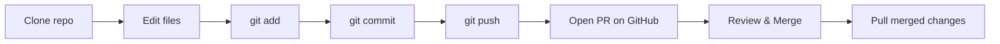

# Git workflow (Mermaid)

A simple visual of the common Git workflow.

```mermaid
flowchart LR
  A[Clone repo] --> B[Edit files]
  B --> C[git add]
  C --> D[git commit]
  D --> E[git push]
  E --> F[Open PR on GitHub]
  F --> G[Review & Merge]
  G --> H[Pull merged changes]
```
