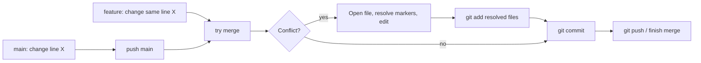

# Merge conflict resolution (Mermaid)

High-level flow for handling merge conflicts.

```mermaid
flowchart LR
  A[main: change line X] --> M[push main]
  B[feature: change same line X] --> N[try merge]
  M --> N
  N --> O{Conflict?}
  O -- yes --> P[Open file, resolve markers, edit]
  P --> Q[git add resolved files]
  Q --> R[git commit]
  R --> S[git push / finish merge]
  O -- no --> R
```
